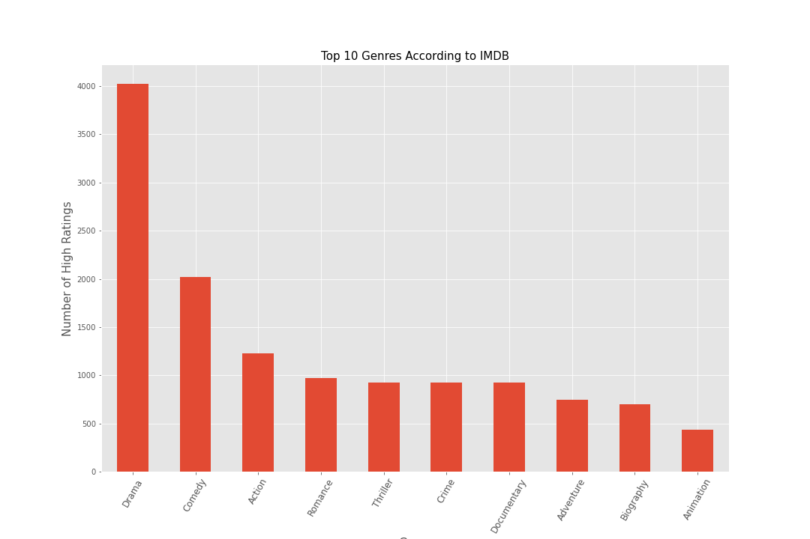
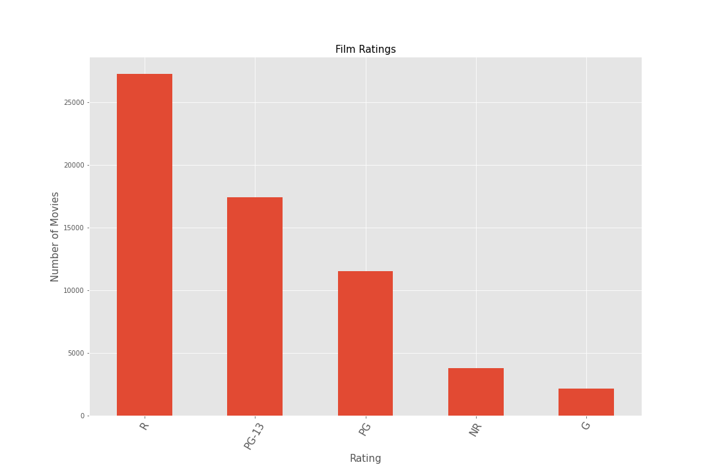
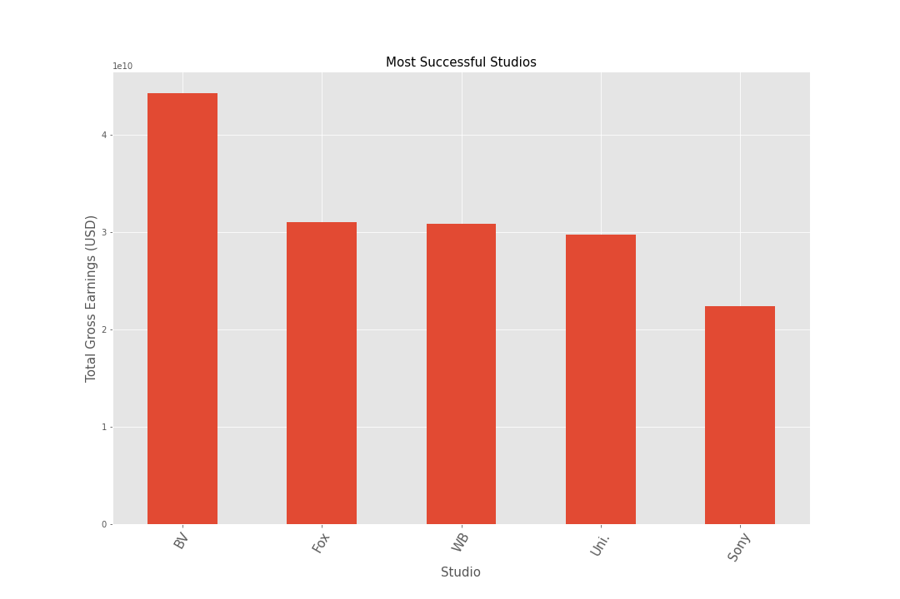

# Phase 1 Project Description

## 1. Introduction

The film industry has been one of the fastest growing markets in recent years.A report by [Global News Wire](https://www.globenewswire.com/news-release/2022/03/08/2398616/0/en/Film-And-Video-Global-Market-Report-2022.html) has shown that as of 2021, the global entertainment market size was valued at USD 244.43 billion. Movies are a significant part of pop culture and a major source of entertainment for a large part of the population and with regards to revenue, the market is expected to be worth USD 409.02 billion by 2026. It is therefore prudent to invest in this market.

## 2. Business Understanding
### 2.1. Problem
Microsoft is setting up a new studio to create original video content. In order to make the necessary decisions resulting in the most profitable movies, there is need to look into data from movie review sites, analyse the data and come up with the recommendations that will lead to this outcome.
From the datasets provided, answers to the following questions can be sought:
   - What are the most popular genres?
   - Who are the best people to attach to this project?
   - What studios can be used as a guide based on their performance in the market?
   - What are the most popular film ratings?

### 2.2 Objectives
- Explore the datasets to answer the business questions.
- Provide recommendations from the outcomes of the analyses.

## 3. Data Understanding
The datasets provided for this analysis were collected from different movie review aggregation sites and contain information on the various movie genres and their popularity among critics and viewers.  
The datasets include:
1. [Box Office Mojo](https://www.boxofficemojo.com/) 
2. [IMDB](https://www.imdb.com/)
3. [Rotten Tomatoes](https://www.rottentomatoes.com/)
4. [The Movie DB](https://www.themoviedb.org/)
5. [The Numbers](https://www.the-numbers.com/)

For this analysis, datasets 1 to 3 were used.

## 4. Exploratory Analysis
### 4.1 What are the most popular genres?
This question was answered by looking at the number of positive reviews per genre. The following graph was produced as result.

### 4.2. What are the most popular film ratings?
This was answered by looking into the types of ratings that had the most number of positive reviews. This produced the following graph.

### 4.3. What are the most successful studios?
This was answered by getting the total gross earnings of the movies and grouping them by the studios that produced the movies. This yielded the following result.

## 5. Conclusion
The analysis done was able to provide answers leading to actionable recommendations. From the findings, the most popular genres were determined to be drama, action and comedy. It was also seen that a movie that does well domestically is likely to do well internationally. In addition to that, R rated movies were found to be most popular and the most competent studios and directors were determined as well.

## 6. Recommendations
From the analysis done above, the following recommendations can be made to Microsoft.

1. The most popular genres are Drama, Comedy and Action. Focusing on these genres is likely to result in a popular movie that is received well by the masses.
2. Microsoft needs to benchmark with the Walt Disney Studios, Fox and Warner Bros as their movies have brought in the highest gross earnings worldwide.
3. R rated films are by far the most popular movies in the industry and Microsoft should focus on those.
4. The best directors to attach to the popular genres are as follows:
     - Drama - Clint Eastwood & Steven Soderbergh
     - Comedy - Noah Baumbach & Taika Waititi
     - Action - Matthew Vaughn & Zack Synder